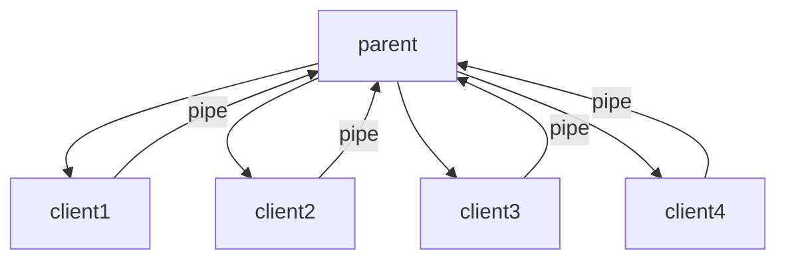

# 一个小型的webbench 测试程序的写法

__本章介绍一下小型的webbench的写法， 本程序是参照 [webbench-1.5](https://github.com/tamlok/webbench) 写的__

## 第一部分 如何做webbench
这个程序的核心在于如果给web发送信息 来计算网络的压力。首先要给server端发送类似如下的字符串来请求server发送数据
```
GET HTTP/1.0
User-Agent: WebBench 1.0
Host: www.google.com
```
当然在上面的函数中 我们可以任意的替换GET 变成HEAD TRACE 等一系列方法。
通过write函数把 这段字符串传递给server端 server会自动的把数据传下来。这样子我们就能测试server 端在一定的时间内传输的数据量是多大了。

当然用fork语句生成更多的子线程去同时访问server端可以帮助我们测试在同一个时间内多少用户同时给server端发消息是否能同时收到消息 这样就可以测量出sever端的压力值了。



父线程最终会总结并且打印出最终的结果。

# 第二部分 源码的讲解：
## webbench 结构体
webbench的总体结构体如下：
```
typedef struct {
  int speed;
  int failed;
  unsigned int bytes;
  volatile unsigned int timerexpired;
  int method;
  int clients;
  int force;
  int force_reload;
  int proxyport;
  char *proxyhost;
  int benchtime;
  char host[MAXHOSTNAMELEN]; // MAXHOSTNAMELEN 64 in linux kernel
  char request[MAX_REQUEST_SIZE];
  http_t http_type;
  int mypipe[2];
} webbench_t;
```
1. __speed__: 这里speed表示在一定的时间给server发送了多少的数据
2. __failed__: 一共失败了多少次，在这里如果一旦给server写数据的时候发生了堵塞那么failed就会加1
3. __bytes__:给server发送数据之后，server会把相应的网页数据读发送给client。这里面记录了在一定时间内读取了多少数据。
4. __timerexpired__:这是一个flag 当时间信号量被触发的时候此值变成1 表示时间已经到了测试完成需要从子进程中撤出来。
5. __method__:表示用什么方式去访问server 我们大部分时间用的是get 当然也可以用其他的方式：
```
 GET: check and find out something from server
 POST: send changed features to the server
 PUT : send new features to the server
 DELETE: remove features from sever.
 CONNECT: allow server to log into another page
 options: allow client check servers performance
 trace:  echo back the response sent by server. mainly using in test.
```
6. __clients__:模仿多少的用户来进行网络的测试
7. __force__:只是发送信息给server 但是不去接受server发送回来的信息
8. __force_reload__: 强制server端重新加载信息（一般不会用到）
9. proxyport 代理server的端口 如果没有涉及到代理端口那么默认为80： 因为默认server的端口就是80
10. __proxyhost__:代理server的地址 如果没有涉及到代理server则为null
11. __benchtime__:测试的时间
12. __host__: 测试的server的地址
13. __request__:  这里面放着我们发送给server端的信息 也就是第一部分讲的内容
14. __mypipe[2]__:用于子进程和父进程通信的管道。

## 如何实现命令行的解析？

getopt_long(int argc, char* const argv, const char* optstring, const struct option* longopts, int *longindex);

-- *argc*:  变量的总数量
-- *argv*:  总变量
-- *optstring*： 所有的短选项 如果是带参数的后面需要加上：
例子：
 ```abd:v?h:f``` 在这里表示d h后面跟着参数.

-- __longopts:__ 在这里表示一个结构体 如下所示：
```
static const struct option long_options[] = {
    {"force", no_argument, &webbench.force, 1},         
    {"reload", no_argument, &webbench.force_reload, 1}, 
    {"time", required_argument, NULL, 't'},            
```
第一个参数是长选项，第二个参数表示有没有带参数， 第三个变量表示如果不是NULL则变量的参数将会保存在里面 第四个参数一般是填短的选项。

## 如何利用fork去创建子进程？
代码如下：
```
  for (i = 0; i < webbench.clients; i++) {
    pid = fork();
    if (pid <= (pid_t)0) {
      sleep(1);
      break;
    }
  }
```

*第一步：* fork出了一个子进程但是子进程pid 为0 所以sleep 1秒 此时父进程又执行了一次fork。  
*第二步：* 父进程再次执行了一次fork又会出现一个子进程 子进程再次进入睡眠。以此类推创建了n个子进程

# pipe是如何使用去进行父子线程通信
请看例成： [sample code](pipsample.c)

需要注意的是 我们需要关闭读那一端写的pipe 而且需要关闭写那一端读的pipe具体原因我们将会更新APUE pipe的时候详细讲述。

请参见[源码](https://github.com/shwzh1990/code_read)
n